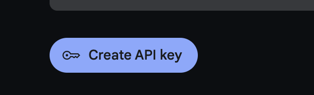
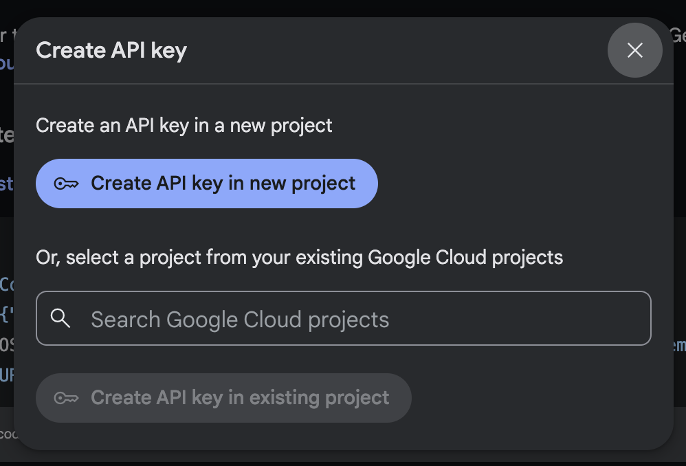
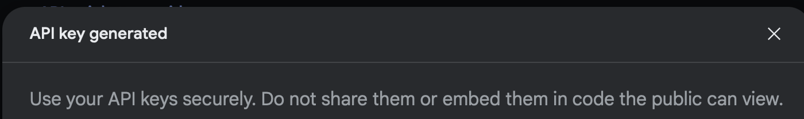
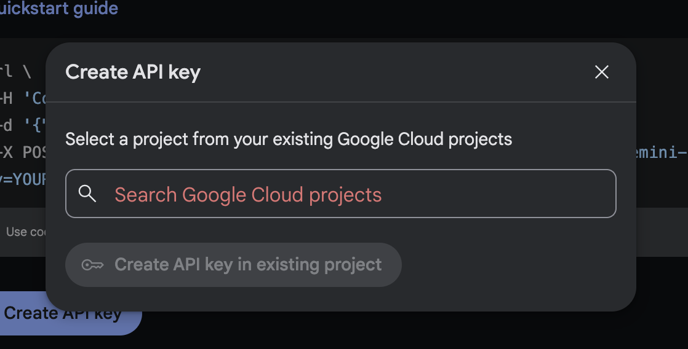
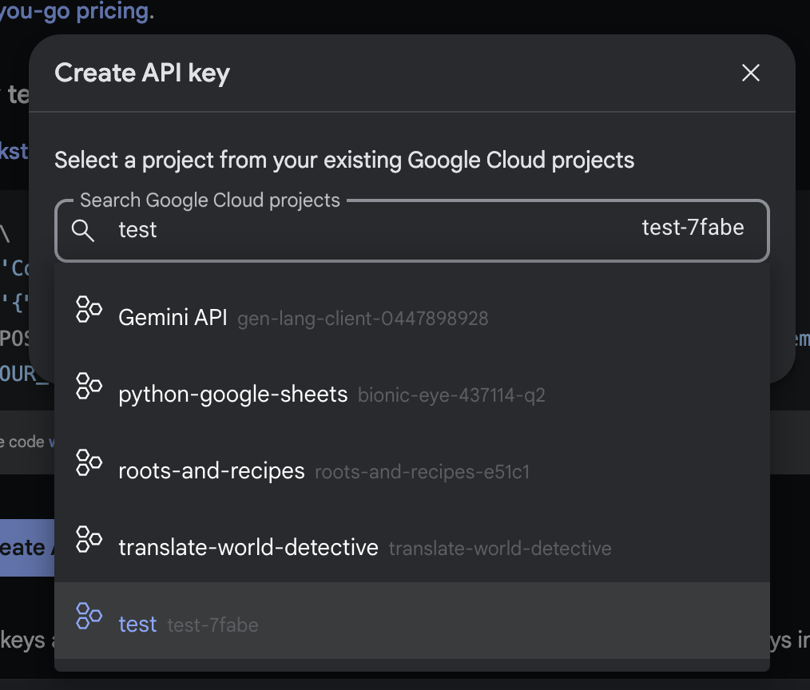

# Gemini API Key Request

This document outlines the process to request a Gemini API key for use in the Gemini API.

## Instructions

1. Go to [Google AI Studio](https://aistudio.google.com/app/apikey) (you may need to sign in with a Google account or sign up for a new account)

2. Click on `Create API key`

3. Accept the terms and conditions

4. You should see a modal like the one below:

5. Click the `Create API key in new project` button

6. You should now see a modal like the one below except, with your API key and a copy button. (Note: API key and button not shown for privacy reasons)

7. Copy your API key and save it in a secure location

8. You will later use this API key to authenticate your requests to the Gemini API

## If you already have a Google Developer Account

When you click on `Create API key` you will see a modal like the one below:

1. Click in the `Create API key in existing project` button

2. Choose a project from the dropdown

3. You will see a modal like the one below:

4. Choose a project from the dropdown

5. The `Create API key in existing project` button should now be enabled. Click it.

3. You should now see a modal like the one below except, with your API key and a copy button. (Note: API key and button not shown for privacy reasons)

7. Copy your API key and save it in a secure location

8. You will later use this API key to authenticate your requests to the Gemini API
